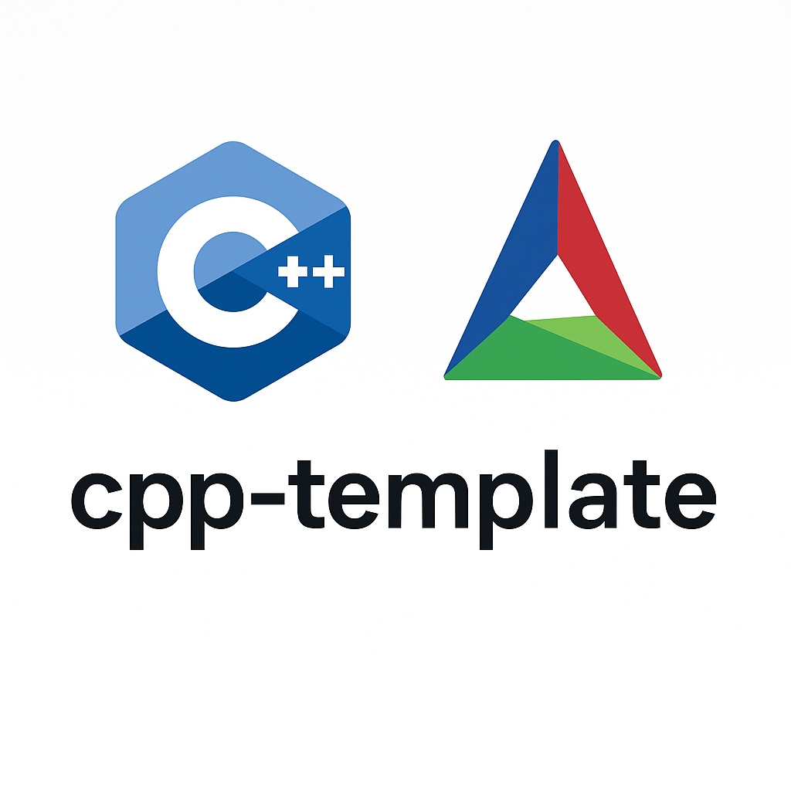

# cpp-template

This is a minimal cross-platform C++17+ project template using CMake. It's designed as a professional-grade starting point for C++ projects, especially useful for beginners and intermediate developers who want a simple, clean build system.

## About This Template

This template is configured for **C++ projects only** (`LANGAUGES CXX`). It does not support C, Python, or other languages.

### Features
- Cross platform
- A minimal `main.cpp` entry point
- A clean build system using CMake
- Commented lines for scalability as project grows
- Organized `src/`, `exclude`, and `include/` layout
- clangd support via compile_commands.json

## Project Layout

``` shell
cpp-template/
+-- CMakeLists.txt # Top-level build config
+-- README.md # Project documentation
+-- LICENSE # Project license (MIT)
+-- .gitignore # Ignore build files and binaries
+-- src/ # Source files (main.cpp entry point)
+-- include/ # (Optional) Public headers
+-- external/ # (Optional) Vendored third-party libraries
+-- assets/ # Media, diagrams, or documentation assets
+-- build/ # CMake build output (ignored by Git)
```
## Features

- Organized `src/` and `include/` layout
- Local dependency management via `add_subdirectory`
- clangd support via compile_commands.json

## Getting Started

### 1. Clone the project

```shell
git clone https://github.com/<your-username>/cpp-template.git
cd cpp-template
```
### 2. Rename the Project

Open `CMakeList.txt` and change this line:

``` cmake
project(<your_project_name> LANGUAGES CXX)
```
To something like this:

``` cmake
project(my_app LANGUAGES CXX)
```
This sets the name of your compiled binary as (./my_app).

### Add your Code

Edit `src/main.cpp` or expand the `src/` directory to build out your program.
You can also add headers in `include/` or new `.cpp` files as needed.

## Using External Libraries

You can link libraries one of two way:

### Option A: System-installed libraries

If a library like `fmt` is already installed (e.g. via `dnf`, `apt`, `brew`), you can enable it like this:

``` cmake
find_package(library_name REQUIRED)
target_link_libraries(${PROJECT_NAME} PRIVATE library_name::library_name)
```
Replace `library_name` with the actual name of the library and its CMake target. Replace `{PROJECT_NAME}` with the name of your project. Make sure the library is installed using your package mananger.

### Option B: Vendored (local) libraries

To keep everything inside the project, you can clone libraries directly into the `external/` folder:

``` shell
git clone --depth 1 https://github.com/your/library.git external/library_name
```
Then modify `CMakeList.txt`:

``` cmake
add_subdirectory(external/library_name)
target_link_libraries(${PROJECT_NAME} PRIVATE library_name::library_name)
```
Repeat this pattern for any additional libraries you want to include locally.

### Building and Running

Once you've written or updated your code in `src/`, you can build and run it:

``` shell
mkdir build
cd build
cmake ..
make
./my_app  # Replace with your project name from CMakeLists.txt
```
### License

This project is licensed under the MIT License. See `LICENSE` for details.
